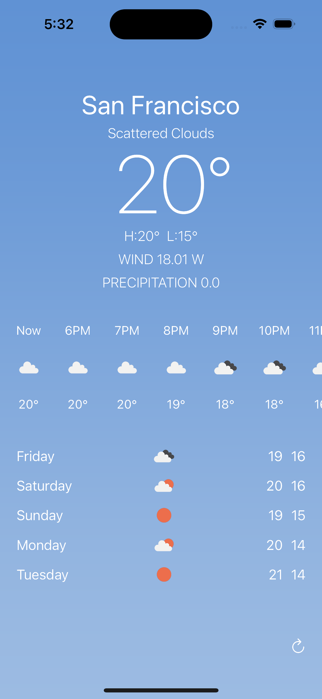

# Weather Forecast App

An iOS application that provides up-to-date weather forecasts using the [OpenWeather API](https://openweathermap.org/api)

## Features

- Display current weather conditions, temperature, wind, and precipitation based on your current location.
- Hourly forecast for the next 24 hours.
- 5-day forecast summary.

## Usage

1. Clone this repository: `git clone https://github.com/ellajchoi/weather.git`
2. Open the project in Xcode: `cd weather && open weather.xcodeproj`
3. Build and run the app in the simulator or on a physical device.